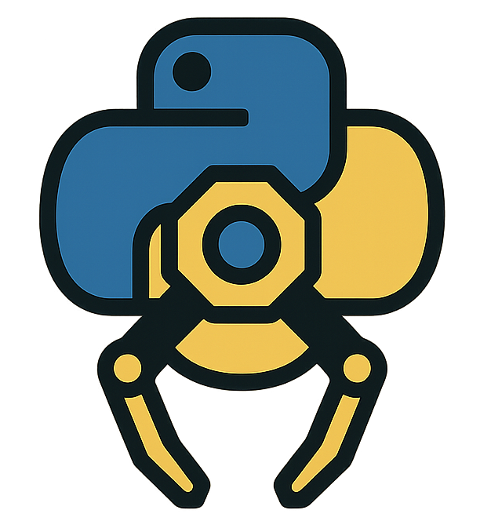

#   pyRobotiqUR for Universal Robots

<p align="left">
    <!--  -->
    <a href="https://github.com/johannesWen/repo2file/actions/workflows/ci.yml">
        
    </a>
    <a href="https://codecov.io/github/johannesWen/pyRobotiqUR">
        
    </a>
</p>

`pyRobotiqUR` is a small Python library that provides a simple socket-based interface
to Robotiq grippers connected to a Universal Robots (UR) controller via the
Robotiq URCap.

It talks to the UR controller over TCP using the Robotiq ASCII `GET/SET` protocol
on the URCap’s internal server port (typically `63352`).

## Features

- Connect to a UR controller over TCP/IP
- Activate / reset the Robotiq gripper
- Move to a raw position `0–255`
- Move using a convenient `0–100 %` interface (`0%` open, `100%` closed)
- Read status, object status and fault codes

## Installation

Install the URCap on your Universal Robots controller first:
- Download the Robotiq URCap from the [Robotiq website](https://robotiq.com/support)
- Install and activate the URCap on your UR controller
- Tested with URCap version `3.27.0` and UR Polyscope version `5.12.4` 

Install from [PyPI](https://pypi.org/project/pyRobotiqUR/) via pip:

```bash
pip install pyRobotiqUR
```

## Usage

Example script:

```python
import time
from pyrobotiqur import RobotiqGripper


UR_IP = "192.168.0.10"   # <-- replace with your UR controller IP


if __name__ == "__main__":
    with RobotiqGripper(UR_IP) as g:
        # Activate gripper (if not already active)
        g.activate()

        print("Opening gripper...")
        g.open(speed=128, force=10)
        time.sleep(3.0)
        print("POS after open:", g.get_position())

        print("Closing gripper...")
        g.close(speed=200, force=200)
        time.sleep(3.0)
        print("POS after close:", g.get_position())

        print("Moving gripper to position 50%...")
        g.move_percent(50, speed=128, force=128)
        time.sleep(3.0)
        print("POS after move_percent:", g.get_position())

        print("Object status:", g.get_object_status())
        print("Fault code:", g.get_fault())
```